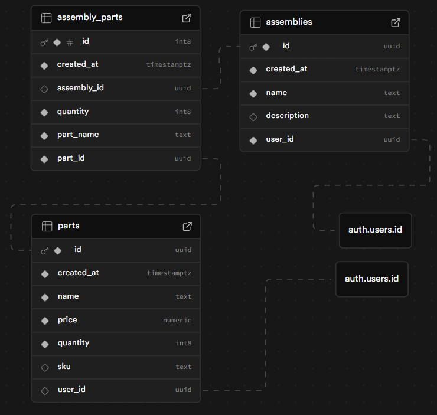

# Have-It Inventory Management

Manage your inventory anywhere!

## About

This is an inventory management application designed to help you manage
inventory. Whether you need to manage supplies for a bicycle repair shop or your
kitchen pantry, Have-It covers it all.

Here's the database schema for this project:


### Built with

This project was built using:

- Vite
- React
- React-Router
- Supabase

## How To

### Install the app

1. Clone the repository

```
git clone https://github.com/GCadel/have-it-inventory
```

2. Navigate to the project directory
3. Create a copy of `.env.local.example` and rename it as `.env.local`
4. Update the values in `.env.local` with your Supabase API keys
5. Using the terminal, navigate to the project directory and install the dependencies

```
npm i
```

6. Start the application via terminal

```
npm run dev
```

7. Navigate to the web page provided by
   the command output

```
  $ npm run dev
  (...misc. output information)

  ➜ Local: http://localhost:5173/
```

### Setup Supabase

1. Go to [https://supabase.com/](https://supabase.com/) and create an account
2. Create an organization, then a new project
3. In the `Project Overview` tab, scroll down to find your `Project URL` and `API Key` for connecting to your project.
4. In the cloned repo, make a copy of `.env.local.example` and rename it to `.env.local`, replace the two variables with the `Project URL` and `API Key` values you retrieved from Supabase
